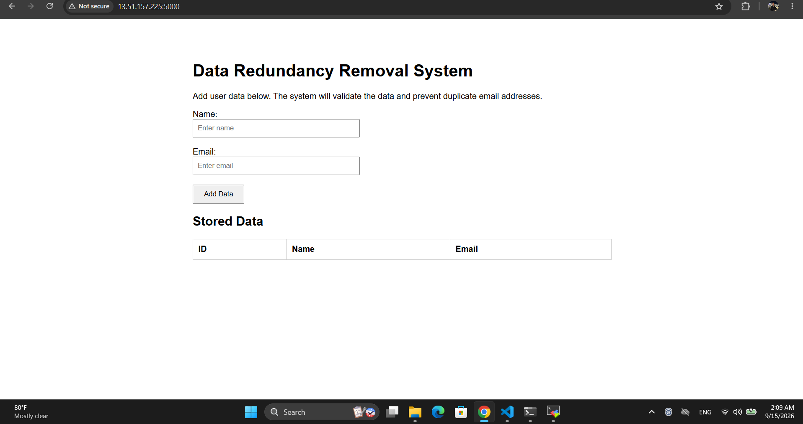
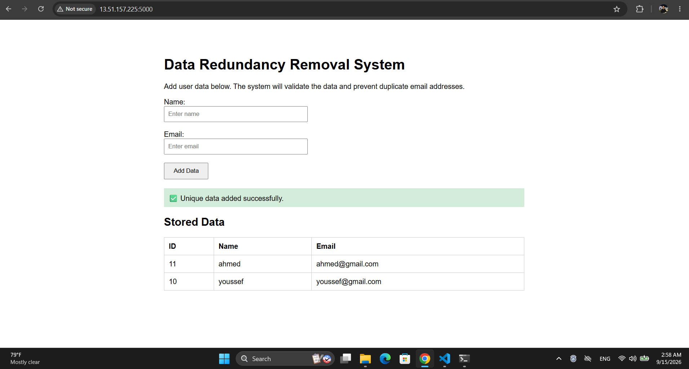
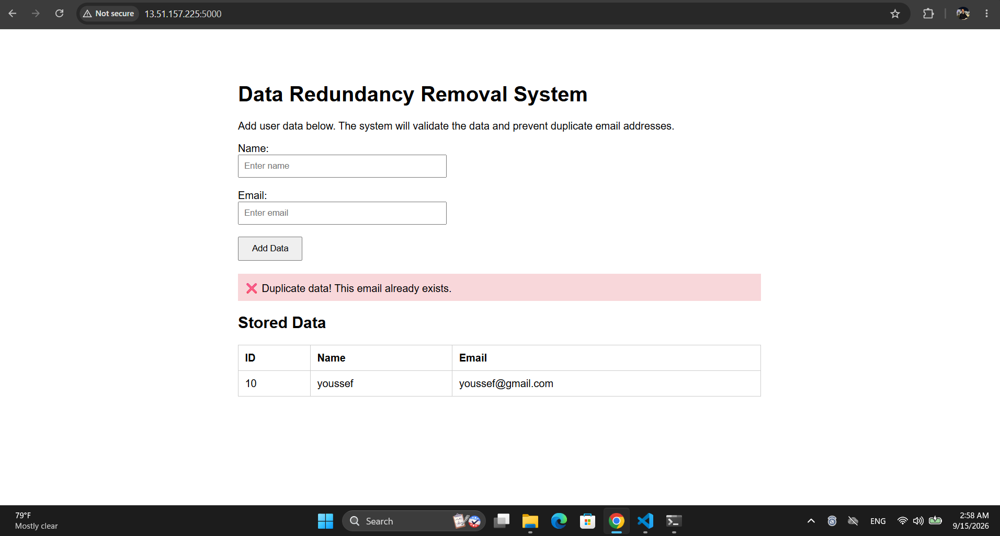

# Data Redundancy Removal System

A Flask-based web application designed to detect and prevent duplicate user data before storing it in a SQLite database.

The system validates user input, checks for duplicate email addresses, and stores only valid and unique records.

## Technologies Used

* Python
* Flask
* SQLite
* HTML
* Pytest
* Git & GitHub
* AWS EC2

## Project Structure

```text
CodeAlpha_DataRedundancySystem/
│
├── app.py
├── data.db
│
├── database/
│   └── db.py
│
├── templates/
│   └── index.html
│
├── tests/
│   └── test_app.py
│
├── screenshots/
│   ├── application.png
│   ├── ec2-instance.png
│   ├── flask-terminal.png
│   ├── project-files.png
│   └── security-group.png
│
└── venv/
```

## Features

* Add new user records
* Validate required fields
* Validate email format
* Detect duplicate email addresses
* Prevent duplicate records
* Store valid and unique data in SQLite
* Automated testing using Pytest
* Deployment on AWS EC2

## Testing

The application was tested using Pytest.

All tests passed successfully:

```text
4 passed
```

### Tests Covered

* Adding a unique user
* Rejecting duplicate email addresses
* Rejecting invalid email addresses
* Rejecting empty fields

## AWS EC2 Deployment

The application was successfully deployed on an Ubuntu AWS EC2 instance.

### EC2 Instance

The application was hosted on an Ubuntu EC2 instance.


*Ubuntu EC2 instance used to host the application.*

### Project Files on EC2

The project was cloned from GitHub and configured on the EC2 instance.


*Project files after cloning the repository on the EC2 instance.*

### Flask Application Running

The Flask application was configured to listen on all network interfaces using port `5000`.

```python
app.run(host="0.0.0.0", port=5000, debug=True)
```


*Flask development server running successfully on the EC2 instance.*

### Security Group Configuration

Inbound TCP traffic was allowed on port `5000` through the EC2 Security Group.


*AWS Security Group configured to allow traffic on port 5000.*

### Application Running on AWS

The deployed application was successfully accessed through the EC2 public IPv4 address.

### Application Running on AWS







*Data Redundancy Removal System running successfully on AWS EC2.*

## Running the Project Locally

Clone the repository:

```bash
git clone https://github.com/Yelsherif14/CodeAlpha_DataRedundancySystem.git
cd CodeAlpha_DataRedundancySystem
```

Create a virtual environment:

```bash
python -m venv venv
```

Activate the virtual environment on Windows:

```bash
venv\Scripts\activate
```

Install the required packages:

```bash
pip install flask pytest
```

Run the application:

```bash
python app.py
```

The application will be available at:

```text
http://127.0.0.1:5000
```

## Running Tests

Run the tests from the project root directory:

```bash
pytest
```

Expected result:

```text
4 passed
```

## Deployment Environment

| Component            | Technology    |
| -------------------- | ------------- |
| Cloud Provider       | AWS           |
| Compute Service      | Amazon EC2    |
| Operating System     | Ubuntu Server |
| Programming Language | Python        |
| Web Framework        | Flask         |
| Database             | SQLite        |
| Testing              | Pytest        |
| Application Port     | 5000          |

## Internship

This project was developed as part of the **CodeAlpha Cloud Computing Internship**.

**Task:** Data Redundancy Removal System

## Author

**Youssef Hisham Ali El-Sherif**
